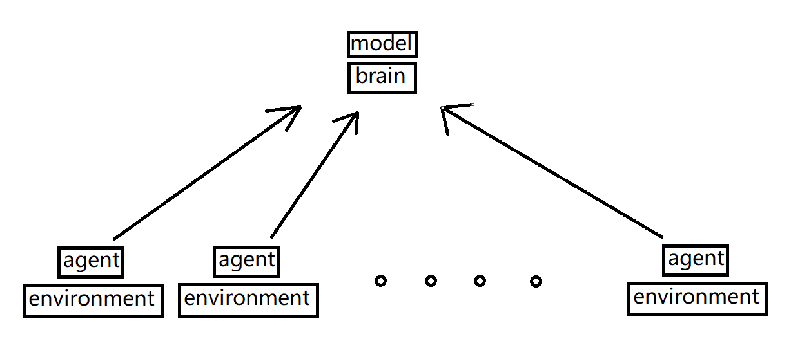

## WARNING 

This code can't cope environment with continuous action

## How to use

### train

`python3 run.py`

### test

move pong or breakout's weight to ./logs/weight

modify index to select weight which you want to use

`python3 test_and_show.py`

## Environment

tensorflow-gpu (2.0.0a0)  
numpy (1.16.4)  
gym (0.13.1)  

## Speed

1070ti and ryzen1700(OC 3.7)

Breakout  
1.58 learning per second

Pong  
1.66 learning per second

## Program structure

environment.py used to create a environment that let agent do something , you can also customize the environment , like process state to speed up convergence

agent.py contain a agent , as an intermediary to communicate with brain , store history data and calculate advantage(adv) and v_target(realv)

brain.py collect data from agent , give data to model after processing like one-hot

model.py calculate gradient , also record experimental data at the same time

config.py contain all hyperparameters

communication.py generate a master and many children , master and children let agent can communicate with brain(exchange data)

test_and_show.py can load weight and run , you can use this to watch AI play atari game

## Algorithm

Proximal Policy Optimization Algorithms

origin paper : https://arxiv.org/abs/1707.06347

There are some different between my code and paper

## Why do this ?

1 . As the initial version of the graduation design , as an initial template

2 . baseline is too complicated , I can't fully understand

3 . Stable Baselines' integration is too high , can't be used to graduation design

So I wrote this project that is easy to understand

